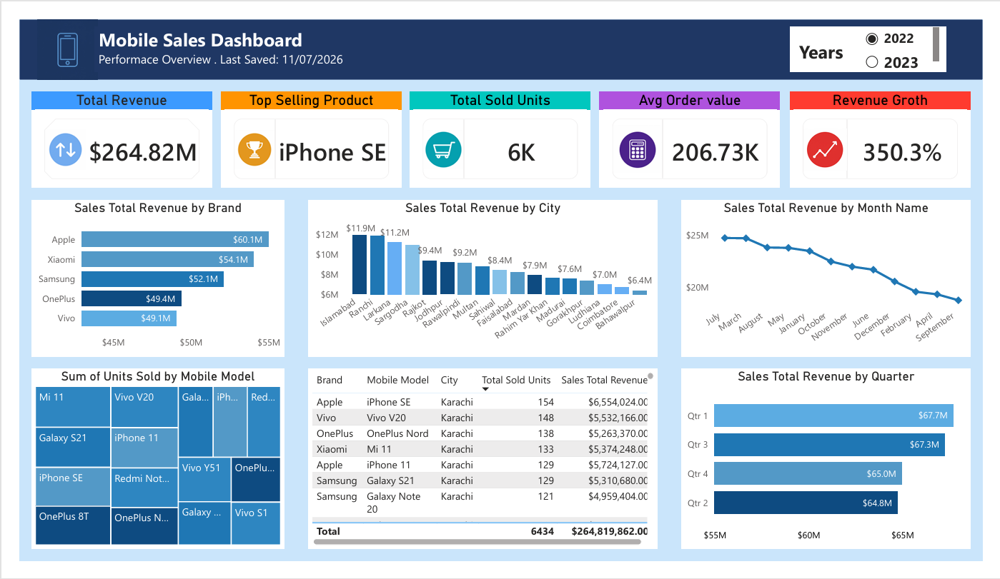

# 📱 Mobile Sales Performance Analysis — SQL Server & Power BI

## Project Overview
**This project analyzes 2 years of international mobile sales data worth $264.82M** to find which brands, products and cities drive revenue, and why monthly sales fell in the third quarter. It shows that **three brands (Apple, Xiaomi and Samsung) generate about 63% of total revenue**, that **iPhone SE is the top-selling product**, and that **monthly revenue dropped about 23% between July and September ($24.8M → $19.1M)**. It provides a data-driven strategy to protect the best-selling products and recover a **monthly revenue gap of about $5.7M**.

[](https://www.linkedin.com/in/hafiz-arslan-shafique-bc240203664/)
[](https://github.com/Hafiz-Arslan-Shafique)
[](https://mail.google.com/mail/?view=cm&fs=1&to=hafizarslan3195@gmail.com)
[](tel:+966579594038)


---
## 🎯 What This Project Does
I analyzed mobile sales transaction data to answer real business questions: which brands and products drive revenue, which cities perform best, and how sales trend over time. I used **SQL Server** for data cleaning, quality checks, and analytical queries, then built an **interactive Power BI dashboard** to communicate the findings.

| | |
|---|---|
| **Total Revenue Analyzed** | $264.82M |
| **Top Brand** | Apple (~$60.1M) |
| **Top Product** | iPhone SE |
| **Top City** | Islamabad (~$11.9M) |
| **Timeframe** | 2022–2023 |
| **Tools** | SQL Server, T-SQL, Power BI, DAX, Power Query, Excel |
---

## 💡 Key Insights
- **Apple leads brand revenue** at ~$60.1M, ahead of Xiaomi (~$54.1M) and Samsung (~$52.1M).
- **iPhone SE is the single top-selling product** by revenue and volume.
- **Revenue Rank vs. Quantity Rank diverge for several products** — some sell high volume at lower price points, others do the opposite. I built a SQL ranking query specifically to surface this gap.
- **Quarterly revenue is stable** (~$65–68M each quarter), while **monthly revenue dipped from ~$24.8M to ~$19.1M** between July and September — a trend worth flagging to stakeholders.
- **City-level breakdown** shows revenue concentration is not limited to one region — performance is spread across 15+ cities, useful for targeted regional strategy.
---

## 🛠️ My Process
1. **Inspected & profiled** the raw dataset in SQL Server (row counts, distinct brands/models/cities, data types).
2. **Checked data quality** — NULL values, duplicate records, and inconsistent text (e.g. trailing spaces in brand names) before trusting any aggregation.
3. **Cleaned the data** using targeted `UPDATE` statements.
4. **Built a reusable SQL View** (`vw_Product_Performance`) to centralize product-level KPIs instead of repeating logic across queries.
5. **Used window functions** (`RANK()`, `PARTITION BY`) to compare products by revenue vs. quantity, and to rank product performance within each city.
6. **Calculated revenue contribution and cumulative revenue %** using a CTE, to identify which products matter most to the bottom line.
7. **Modeled and visualized results in Power BI**, with DAX measures for Total Revenue, Average Order Value, and Year-over-Year Revenue Growth.

<details>
<summary><b>📂 See full SQL queries with explanations</b></summary>
  
### 1. Database & Table Inspection
```sql
USE Mydata;
SELECT * FROM dbo.Mobile_sales_data;
SELECT TOP 10 * FROM dbo.Mobile_sales_data;
```
### 2. Column & Data Type Check
```sql
SELECT COLUMN_NAME, DATA_TYPE
FROM INFORMATION_SCHEMA.COLUMNS
WHERE TABLE_NAME = 'Mobile_sales_data';
```
### 3. Dataset Profiling
```sql
SELECT
    COUNT(*) AS Total_Rows,
    MIN(Year) AS Min_Year,
    MAX(Year) AS Max_Year,
    COUNT(DISTINCT Brand) AS Unique_Brands,
    COUNT(DISTINCT Mobile_Model) AS Unique_Models,
    COUNT(DISTINCT City) AS Unique_Cities
FROM Mobile_sales_data;
```
### 4. NULL Value Check
```sql
SELECT
    SUM(CASE WHEN Brand IS NULL THEN 1 ELSE 0 END) AS Null_Brand,
    SUM(CASE WHEN Mobile_Model IS NULL THEN 1 ELSE 0 END) AS Null_Model,
    SUM(CASE WHEN Total_Sales IS NULL THEN 1 ELSE 0 END) AS Null_Sales,
    SUM(CASE WHEN Sum_of_Units_Sold IS NULL THEN 1 ELSE 0 END) AS Null_Units
FROM Mobile_sales_data;
```
### 5. Duplicate Detection
```sql
SELECT [Sr_No], COUNT(*) AS Dup_Count
FROM Mobile_sales_data
GROUP BY [Sr_No]
HAVING COUNT(*) > 1;
```
### 6. Text Cleaning
```sql
UPDATE Mobile_sales_data SET Brand = LTRIM(RTRIM(Brand));
UPDATE Mobile_sales_data SET Mobile_Model = LTRIM(RTRIM(Mobile_Model));
UPDATE Mobile_sales_data SET City = LTRIM(RTRIM(City));
UPDATE Mobile_sales_data SET Payment_Method = LTRIM(RTRIM(Payment_Method));
```
### 7. Product Performance View
```sql
DROP VIEW IF EXISTS vw_Product_Performance;
CREATE VIEW vw_Product_Performance AS
SELECT
    Brand,
    Mobile_Model,
    COUNT(*) AS Num_Transactions,
    SUM(Sum_of_Units_Sold) AS Total_Units_Sold,
    SUM(Total_Sales) AS Total_Revenue,
    AVG(Sum_of_Price_Per_Unit) AS Avg_Price_Per_Unit,
    SUM(Total_Sales) * 1.0 / NULLIF(SUM(Sum_of_Units_Sold), 0) AS Calculated_Avg_Price,
    AVG(Sum_of_Customer_Ratings * 1.0) AS Avg_Customer_Rating
FROM Mobile_sales_data
GROUP BY Brand, Mobile_Model;
```

> **Note:** In SSMS, run `DROP VIEW` and `CREATE VIEW` as separate batches (`GO`) if required.
### 8. Revenue vs. Quantity Ranking
```sql
SELECT
    Brand, Mobile_Model, Total_Revenue, Total_Units_Sold,
    RANK() OVER (ORDER BY Total_Revenue DESC) AS Revenue_Rank,
    RANK() OVER (ORDER BY Total_Units_Sold DESC) AS Quantity_Rank,
    RANK() OVER (ORDER BY Total_Revenue DESC) -
    RANK() OVER (ORDER BY Total_Units_Sold DESC) AS Rank_Diff
FROM vw_Product_Performance
ORDER BY Total_Revenue DESC;
```
### 9. Revenue Contribution % (CTE + Window Function)
```sql
WITH ProductTotals AS (
    SELECT SUM(Total_Sales) AS Grand_Total FROM Mobile_sales_data
)
SELECT
    Brand, Mobile_Model, Total_Revenue,
    CAST(Total_Revenue * 100.0 / t.Grand_Total AS DECIMAL(5,2)) AS Revenue_Pct,
    SUM(Total_Revenue * 100.0 / t.Grand_Total)
        OVER (ORDER BY Total_Revenue DESC ROWS UNBOUNDED PRECEDING) AS Cum_Revenue_Pct
FROM vw_Product_Performance
CROSS JOIN ProductTotals t
ORDER BY Total_Revenue DESC;
```
### 10. City-Level Product Performance
```sql
SELECT
    City, Brand, Mobile_Model,
    SUM(Total_Sales) AS City_Revenue,
    RANK() OVER (PARTITION BY City ORDER BY SUM(Total_Sales) DESC) AS Rank_In_City
FROM Mobile_sales_data
WHERE Mobile_Model IN ('iPhone SE', 'OnePlus Nord', 'Galaxy Note 20', 'Vivo Y51', 'Galaxy S21')
GROUP BY City, Brand, Mobile_Model
ORDER BY City, Rank_In_City;
```
</details>

<details>
<summary><b>📊 See Power BI DAX measures</b></summary>
```DAX
Total Revenue = SUM(Mobile_sales_data[Total_Sales])
Total Units Sold = SUM(Mobile_sales_data[Sum_of_Units_Sold])
Average Order Value = DIVIDE([Total Revenue], DISTINCTCOUNT(Mobile_sales_data[Sr_No]))
Average Price Per Unit = DIVIDE([Total Revenue], [Total Units Sold])
Revenue Growth % = VAR CurrentRevenue = [Total Revenue]
VAR PreviousRevenue = CALCULATE([Total Revenue], DATEADD('Date'[Date], -1, YEAR))
RETURN
    DIVIDE(CurrentRevenue - PreviousRevenue, PreviousRevenue)
```
*(DAX measures reconstructed to match the dashboard's KPI logic.)*
</details>

---
## 📁 Repository Structure
```text
Mobile-Sales-Analytics-Dashboard-SQL-PowerBI/
├── Mobile_Sales_Analysis_Dashboard.pbix
├── Mobile_sales_data.xlsx
├── mobile_sales_analysis.sql
├── mobile_sales_dashboard.png
└── README.md
```

---
## 🚀 How to Run

**SQL Server:** Open SSMS → create/select database `Mydata` → import data into table `Mobile_sales_data` → run `mobile_sales_analysis.sql` in order.

**Power BI:** Open `Mobile_Sales_Analysis_Dashboard.pbix` → update data source if needed → click **Refresh** → explore via the Year slicer and dashboard visuals.

> If `.pbix` exceeds GitHub's file-size limit, Git LFS may be needed.

---

## 🎓 Skills Demonstrated

**SQL Server:** Data profiling, quality checks, cleaning, Views, CTEs, window functions (`RANK`, `PARTITION BY`), revenue/quantity ranking, contribution analysis

**Power BI:** Dashboard design, data modeling, DAX, Power Query, slicers, trend & KPI visualization

**Analytical thinking:** Translating raw transactional data into business questions, prioritizing insights that support decisions, not just describing numbers

---

## 👨‍💻 Author

**Hafiz Arslan Shafique**
Data Analyst | SQL Server · Power BI · Excel

📧 [Email](https://mail.google.com/mail/?view=cm&fs=1&to=hafizarslan3195@gmail.com) · 💼 [LinkedIn](https://www.linkedin.com/in/hafiz-arslan-shafique-bc240203664/) · 🗂️ [GitHub](https://github.com/Hafiz-Arslan-Shafique) . 📞 Phone: +966 57 959 4038
